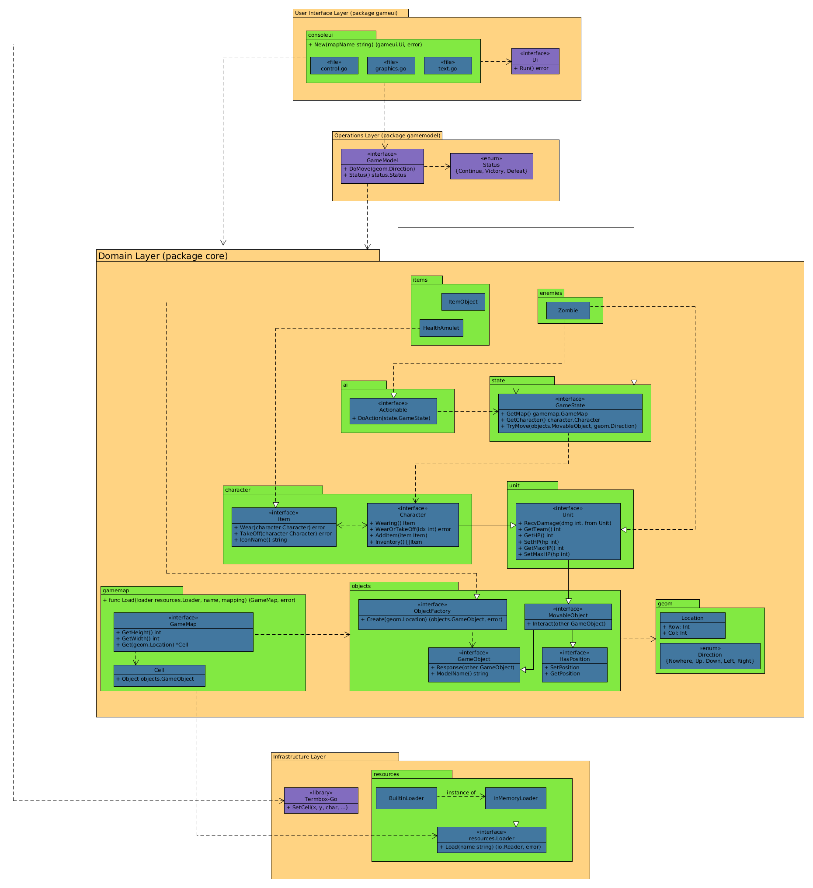

# Roguelike

Simple roguelike game skeleton, written in Go using Termbox-Go library.

## Building and running

* install go: https://golang.org

* checkout the repository: `git clone git@github.com:xosmig/roguelike.git`

* `cd roguelike`

* `go build`

* `./roguelike`

## Working with sources

* You can run unit tests using `go test ./...` or simply `./test.sh`

* You can run `./generate.sh` to regenerate the generated sources (such as mock objects)

## Structure diagram
`diagrams/structure.png`

